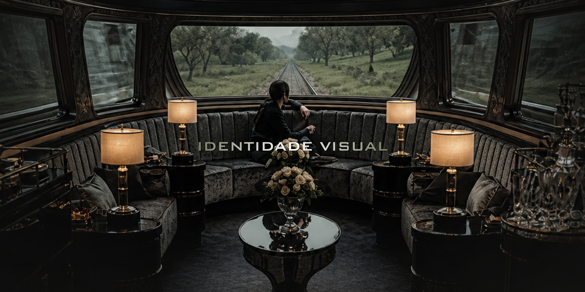

## 1. CONCEITO

A identidade visual é o conjunto de elementos visuais utilizados para representar e comunicar a identidade de um projeto, sistema ou marca. Em sistemas digitais, esses elementos contribuem para a organização das informações, a compreensão da interface e a experiência do usuário.

No Sistema de Monitoramento Ferroviário Inteligente, a identidade visual foi planejada para representar tecnologia, monitoramento e eficiência, mantendo uma interface funcional e de fácil compreensão.

## 2. ESTUDO DA IDENTIDADE VISUAL

A identidade visual do sistema utiliza principalmente azul-marinho, preto e branco.

O azul-marinho está associado à tecnologia e à confiança, enquanto o preto contribui para uma aparência moderna e o branco proporciona contraste e facilita a leitura das informações.

Além das cores, o sistema utiliza um estilo minimalista e geométrico, inspirado em dashboards industriais e interfaces tecnológicas. O uso de linhas, ícones simples e elementos organizados em blocos contribui para uma interface mais clara.

A tipografia também segue uma proposta moderna e objetiva, priorizando a legibilidade das informações apresentadas no sistema.

## 3. ESTILO E REFERÊNCIAS VISUAIS

O estilo visual do sistema foi inspirado em interfaces industriais, dashboards e sistemas de monitoramento. A proposta busca transmitir inovação, controle operacional e eficiência tecnológica.

Durante o desenvolvimento do layout, foram analisadas referências de interfaces digitais, combinações de cores, tipografia e organização de informações.

Plataformas de inspiração visual e ferramentas de prototipação também podem auxiliar no desenvolvimento da identidade visual e na criação dos primeiros modelos da interface.

## 4. APLICAÇÃO NO PROJETO

A identidade visual será aplicada aos principais elementos da interface, como:

- menus e barras de navegação;
- cartões de informações;
- gráficos e indicadores;
- tabelas;
- botões;
- ícones;
- telas de monitoramento;
- alertas e notificações.

A padronização desses elementos contribui para manter uma interface consistente e facilitar a navegação do usuário.

## REFERÊNCIAS

ADOBE. Adobe Color. Disponível em: https://color.adobe.com/pt/create/color-wheel. Acesso em: 20 maio 2026.

GOOGLE. Google Fonts Knowledge. Disponível em: https://fonts.google.com/knowledge. Acesso em: 20 maio 2026.

MATERIAL DESIGN. Material Design. Disponível em: https://m2.material.io/design/foundation-overview. Acesso em: 20 maio 2026.

NIELSEN NORMAN GROUP. Principles of Visual Design. Disponível em: https://www.nngroup.com/articles/principles-visual-design/. Acesso em: 20 maio 2026.

COLOR MATTERS. Color and Design. Disponível em: https://www.colormatters.com. Acesso em: 20 maio 2026.